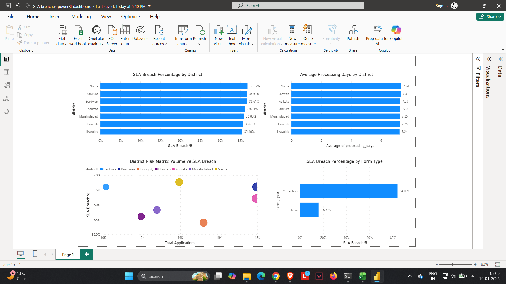
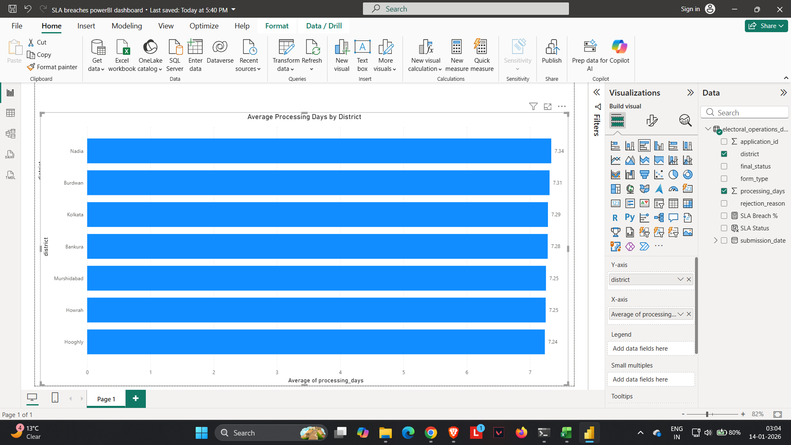
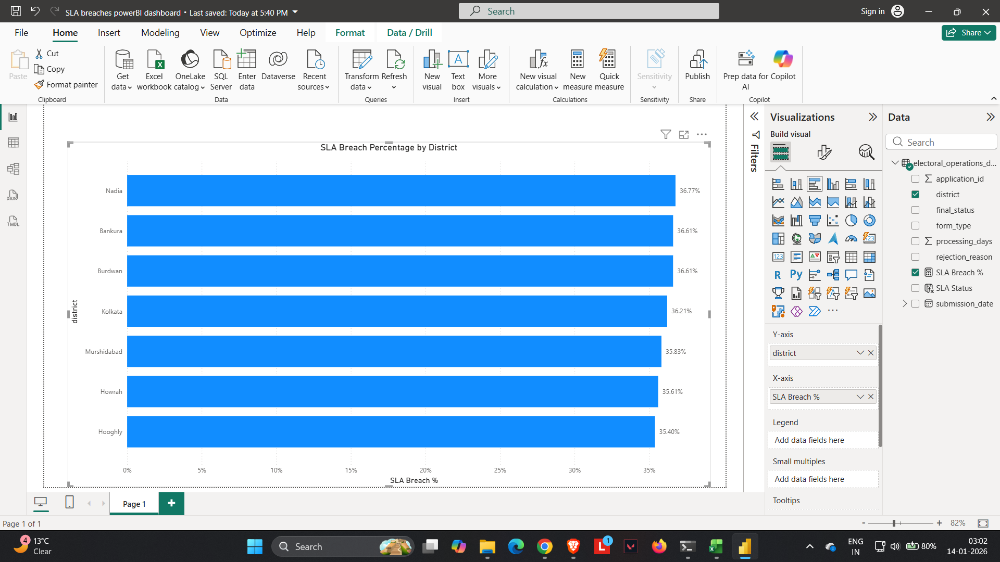
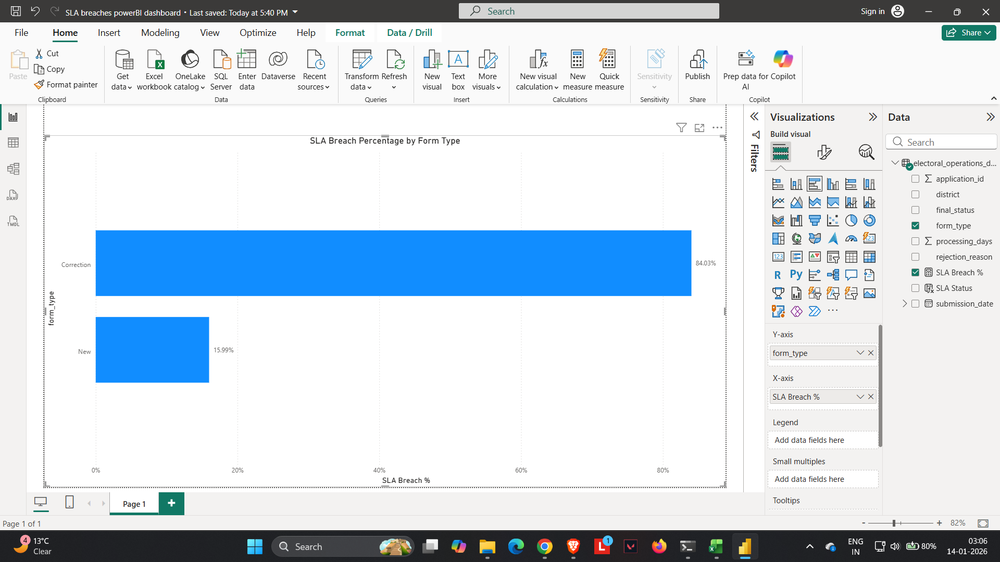
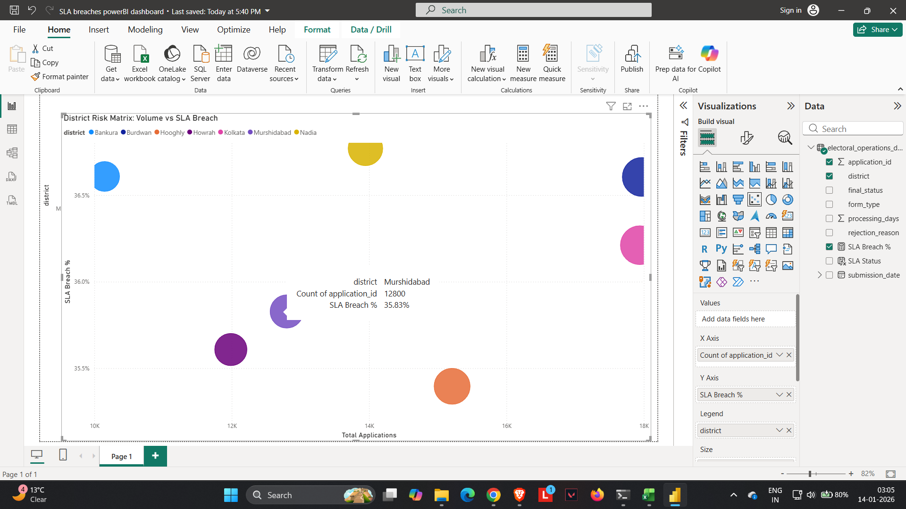

# Dashboard Overview

This dashboard presents key performance indicators and risk signals related to voter application processing and SLA adherence.

The visuals are designed to help stakeholders quickly identify:
- Districts with processing delays
- Areas with high SLA breach risk
- Operational drivers behind SLA violations

---

## Visual Guide

### Dashboard Overview
Provides a consolidated snapshot of application volume, processing time, and SLA performance.

---

### Average Processing Days by District
Highlights districts with prolonged processing timelines, indicating potential capacity or workflow inefficiencies.

---

### SLA Breach Percentage by District
Shows the percentage of applications breaching SLA thresholds across districts, enabling performance comparison.

---

### Form Type vs SLA Breach
Compares SLA breach rates between new registrations and correction requests to isolate complexity-driven delays.

---

### District Risk Matrix (Volume vs SLA Breach)
Maps districts based on workload and SLA breach percentage to prioritize high-risk operational zones.

